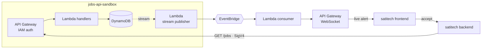

 jobs-api-sandbox
# Mock third-party jobs API for satitech/shotown— DynamoDB-backed, publishes job events to EventBridge.
 make Bold and underline
# WHY
the sati-app was designed around the Upwork api as a tool i wanted to use to help arrange task and (maybe get fresh data) fist directly on the platform. Approval isn't guaranteed hence this service.

# Architecture

# Mock Event Payload
{
  "event_id": "evt_01HQZK4M8N",
  "event_type": "job.posted",
  "occurred_at": "2026-08-15T14:22:09Z",
  "data": {
    "id": "job_8f3kd92m",
    "title": "Build a React dashboard for inventory tracking",
    "description": "Looking for a developer to...",
    "posted_at": "2026-08-15T14:22:04Z",
    "budget": { "type": "fixed", "amount": "1500.00", "currency": "USD" },
    "skills": ["react", "typescript", "postgresql"],
    "duration_estimate": null,
    "client": {
      "id": "cl_2k9dm4",
      "name": "Northwind Supply Co.",
      "country": "US",
      "verified": true,
      "jobs_posted": 14
    }
  }
}

# Endpoints
Method	Path	    Purpose
GET	    /jobs	    List recent jobs, newest first
GET	    /jobs/{id}	Fetch a single job
POST	/jobs	    Create a job — triggers the event pipeline

# Related
Consumed by satitech — the app this service pretends to be a third party for.